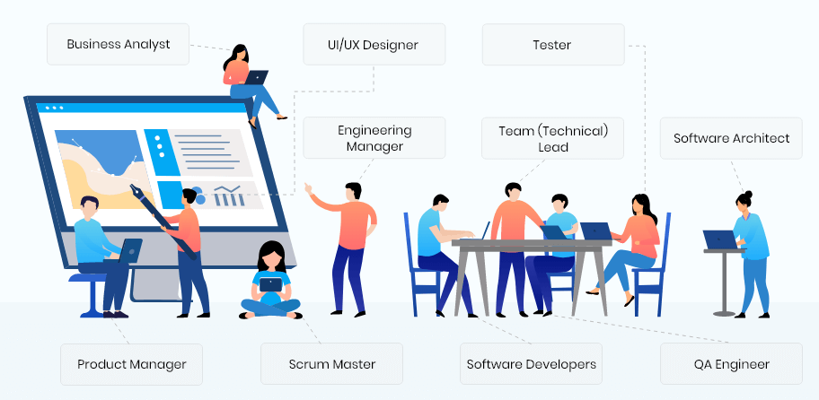
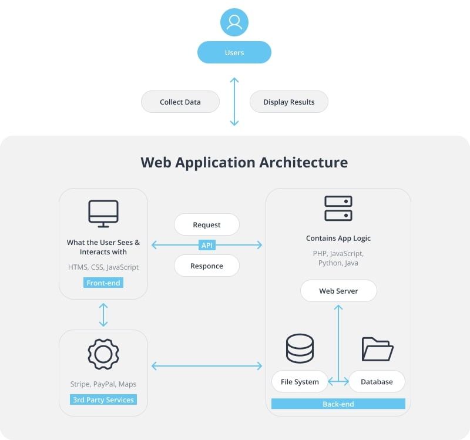

# Learn To Dev

## Who are the audiences ?

So you have learnt some programming languages(Java, Python, Javascript etc), gained some understanding of data structure, algorithm. 

Wandering what's the next step. Or you have get ready for coding exercises, but need some hands-on experiences. 

This is a bootcap for you to get boosted and get ready for your interview. 

## Software Development 101

A typical modem software development organization will look like this. 

### Roles in software organizations

#### TMP(Technology Marketing and Product)
- Researcher
- Marketing Manager

- Product Manager
- UX Designer
- Architect
- Software Engineer

#### Sales

- Sales Engineer
- Account Executive

## Product Management 101

- Product Requirement Document
  - [PRD](https://productschool.com/resources/glossary/product-requirements-doc-prd?utm_source=google&utm_medium=referral&utm_campaign=202304-mkt_templates-product_management_templates)
- 1 Pager Sample/Template
  - [1 Pager Template](https://docs.google.com/document/d/1hs2TH00BYy_reNbCaGIRyWXJGiaDTEgAuRztnYd-dgU/edit)
  - [PRD Template](https://docs.google.com/document/d/1hs2TH00BYy_reNbCaGIRyWXJGiaDTEgAuRztnYd-dgU/edit)

## UX Design 101

- Figma sample

## Engineering 101

### Design

- Architecture
  - Web and Native Applications
    - Web Application Architecture
      - 
    - Native Application Architecture
      - 
    - Lab
  - Tiered Architecture
      - Backend
      - Frontend
  - Flutter basics
      - Tutorial
  
- Design
  - High Level Design
  - Low Level Design

### Implementation/Programming

- Java basics
  - Lab
- SQL basics
  - Lab
- Restful basics
  - Lab
- Javascript basics
  - Lab

### Dev Tools

- [Git](chapters/Git.md)
- Continuous Integration
  - Jenkins

### Testing

- Unit Testing
  - JUnit
  - FindBugs
  - CheckStyle
- Integration Testing
  - API Test
- Functional Testing
  - Selenium Testing
  - Lab
- Performance Testing
  - JMeter
  - Lab

## Planning & Bug Tracking

- [Jira](https://www.atlassian.com/software/jira/pricing?&aceid=&adposition=&adgroup=136973856130&campaign=18440774082&creative=656629737110&device=c&keyword=jira%20license&matchtype=p&network=g&placement=&ds_kids=p73345603391&ds_e=GOOGLE&ds_eid=700000001558501&ds_e1=GOOGLE&gad_source=1&gclid=CjwKCAjwz42xBhB9EiwA48pT78lVhpvydErULI5WIQahFYsEy5GX-Fw65fzyV_g4aoC-RHuI2-XBdRoCk-MQAvD_BwE&gclsrc=aw.ds)
- [YouTrack](https://www.jetbrains.com/youtrack/buy/?gutm_medium=cpc&gutm_source=google&gutm_campaign=AMER_en_US-EST_YouTrack_Search_Competitors&gutm_content=692489595350&gclid=CjwKCAjwz42xBhB9EiwA48pT76qH7sNLqO5WAV1VwQK9N2JKFykFxrS226xvcGNcTHTTxP4P1DoGxhoCebIQAvD_BwE)

## Scrum 101

- Scrum basics
- Planning
- Daily Standup
- Retrospective
- Backlog grooming

## Advanced Topics

- Design Patterns

- Concurrent Programming

- MicroServices

- Message Queues

- Build scalable applications
