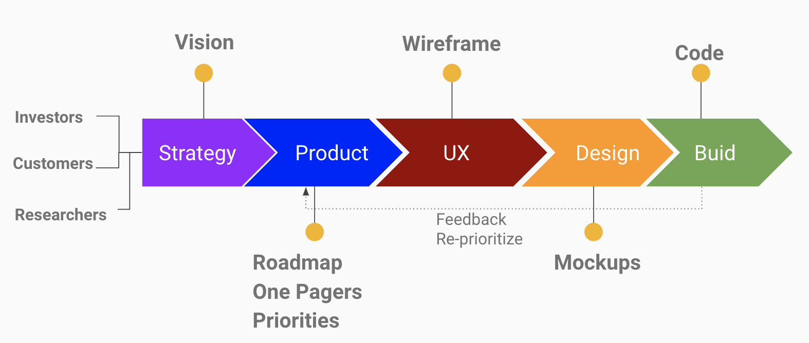

# Learn To Dev

## Who are the audiences ?

So you have learnt some programming languages(Java, Python, Javascript etc), gained some understanding of data structure, algorithm. 

Wandering what's the next step. Or you have get ready for coding exercises, but need some hands-on experiences. 

This is a bootcap for you to get boosted and get ready for your interview. 

## Prerequisites

- Hardware
- Software
- Recommendations
  - MacOS

## Software Development 101

### Software Development Phases

### Roles in software organizations
A typical modem software development organization will look like this.

#### TMP(Technology Marketing and Product)
- Researcher
- Marketing Manager

- Product Manager

- UX Designer

- Software Architect 

  A software architect makes high-level design choices and frames technical standards. 
  This might include tools, software coding standards, or platforms to be used. 
  To be effective, a software architect needs broad (and deep) technical knowledge to make good decisions. 
  However, technical knowledge isn’t enough. They also have to have the soft skills to manage projects and people. 

  A great Software Architect employs a mix of great technical skills, the ability to take a high-level look, 
  and great interpersonal skills.

- Software Engineer

#### Sales

- Sales Engineer
- Account Executive

## Product Management 101

- Product Requirement Document
  - [PRD](https://productschool.com/resources/glossary/product-requirements-doc-prd?utm_source=google&utm_medium=referral&utm_campaign=202304-mkt_templates-product_management_templates)
- 1 Pager Sample/Template
  - [1 Pager Template](https://docs.google.com/document/d/1hs2TH00BYy_reNbCaGIRyWXJGiaDTEgAuRztnYd-dgU/edit)
  - [PRD Template](https://docs.google.com/document/d/1hs2TH00BYy_reNbCaGIRyWXJGiaDTEgAuRztnYd-dgU/edit)

## UX Design 101

- Tutorial
  - https://www.youtube.com/watch?v=Cx2dkpBxst8
  - https://www.youtube.com/watch?v=wvFd-z7jSaA

- [Sample Figma](https://www.figma.com/proto/Mt1Y8UlLRKmgWXfrJOhaIj/Wallet-App-Design-(Community)?type=design&node-id=2-97&t=7Krh6c2H9s4eem57-1&scaling=scale-down&page-id=2%3A4&starting-point-node-id=2%3A97)

## Engineering 101

### Design

- Architecture
  - Web Application Architecture
    - 
  - Native Application Architecture
    - 
  - Backend
    - [Java](chapters/Java.md)
    - [JavaScript(Server side with NodeJs)](chapters/Javascript.md)
    - Python
    - PHP
  - Frontend
    - HTML
    - CSS
    - JavaScript
  - Flutter basics
    - [Tutorial “PetClinic” application with Springboot and Flutter](https://github.com/andytmass/petclinic)
      
- Design
  - High Level Design
  - Low Level Design

### Implementation/Programming

- Java basics
- [SQL basics](chapters/Sql.md)
- Restful basics
- Javascript basics

### Dev Tools

- [Git](chapters/Git.md)
- Continuous Integration
  - Jenkins

### Security

- [Security](chapters/Security.md)

### Testing

- [Unit Testing](chapters/UnitTest.md)
- Integration Testing
  - API Test
- Functional Testing
  - Selenium Testing
  - Lab
- [Performance Testing](chapters/PerfTest.md)

## Planning & Bug Tracking

- [Jira](https://www.atlassian.com/software/jira/pricing?&aceid=&adposition=&adgroup=136973856130&campaign=18440774082&creative=656629737110&device=c&keyword=jira%20license&matchtype=p&network=g&placement=&ds_kids=p73345603391&ds_e=GOOGLE&ds_eid=700000001558501&ds_e1=GOOGLE&gad_source=1&gclid=CjwKCAjwz42xBhB9EiwA48pT78lVhpvydErULI5WIQahFYsEy5GX-Fw65fzyV_g4aoC-RHuI2-XBdRoCk-MQAvD_BwE&gclsrc=aw.ds)
- [YouTrack](https://www.jetbrains.com/youtrack/buy/?gutm_medium=cpc&gutm_source=google&gutm_campaign=AMER_en_US-EST_YouTrack_Search_Competitors&gutm_content=692489595350&gclid=CjwKCAjwz42xBhB9EiwA48pT76qH7sNLqO5WAV1VwQK9N2JKFykFxrS226xvcGNcTHTTxP4P1DoGxhoCebIQAvD_BwE)

## Scrum

- [Scrum Basics](chapters/Scrum.md)

## Advanced Topics

- Design Patterns

- Concurrent Programming

- MicroServices

- Message Queues

- Build scalable applications
