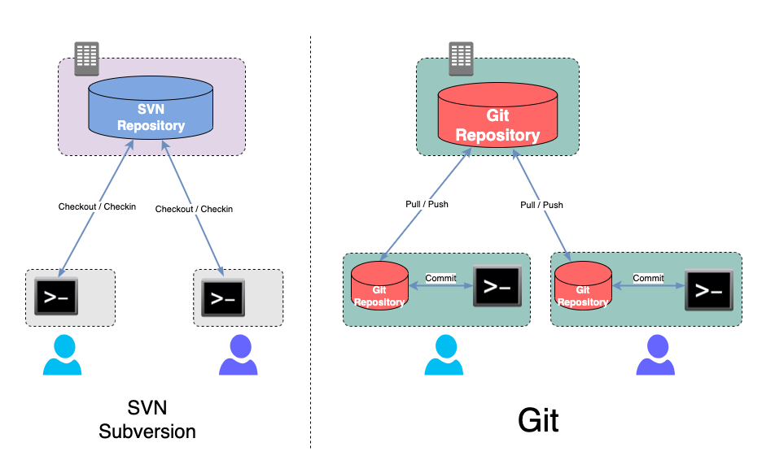
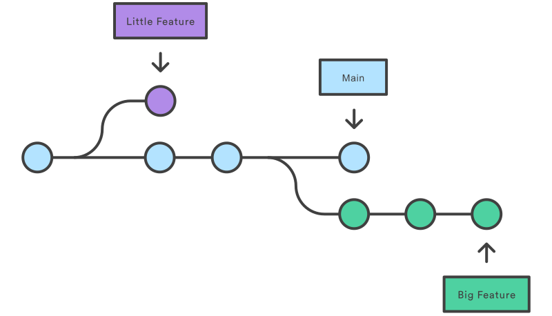
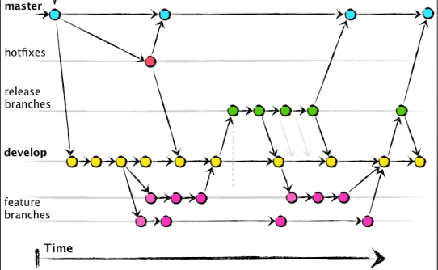
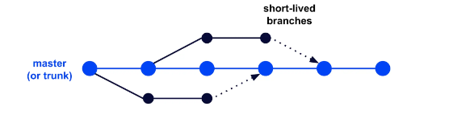

# Git 101

## Git concept

- What is Git

Git is a distributed version control system that tracks changes in any set of computer files, 
usually used for coordinating work among programmers who are collaboratively developing source code during software development. 

Git's goals include speed, data integrity, and support for distributed, non-linear workflows. Wikipedia

- Why uses Git

Git is all about efficiency. 
For developers, it eliminates everything from the time wasted passing commits over a network connection to the man hours required to integrate changes in a centralized version control system. 
It even makes better use of junior developers by giving them a safe environment to work in. 
All of this affects the bottom line of your engineering department.

## Git vs SVN



## Branching strategy

- What is branching

Git branches are effectively a pointer to a snapshot of your changes. 
When you want to add a new feature or fix a bug—no matter how big or how small—you spawn a new branch to encapsulate your changes.



- Git Flow



- Trunk based flow



## Most Frequent Used Git commands

```
#
git clone <url-to-repository>

# display local branches
git branch

# display local repo status
git status

# pull the latest remote branch to local repo
git pull

# local branching
git checkout -b <new-branch-name>

# git add all local changes to stage area
git add -A . 

# git add changs to stage area
git add <path-to-file>

# checkin stage area to local repo
git commit -am "your commit message"

# check-in locally
git status
git add -A . 
git commit -am "<your commit message"

# push to remote repo
git push 

# rebase
git pull <local-branch>
git rebase <local-branch> <feature-branch>

```

## Git cheat sheet

- [Git Cheat Sheet](https://www.atlassian.com/git/tutorials/atlassian-git-cheatsheet)

## Step by Step Tutorial

- Sign up on Github.com
- Setup Git SSH Key
- Work on a repository
  - Clone existing repository from github
  - Init an empty repository
  - Add existing directory to Git
- Create a local feature branch
- Make some changes
- 

## References

- [What is the differences between GIT and SVN](https://www.linkedin.com/pulse/what-differences-between-git-svn-kareem-zock/)