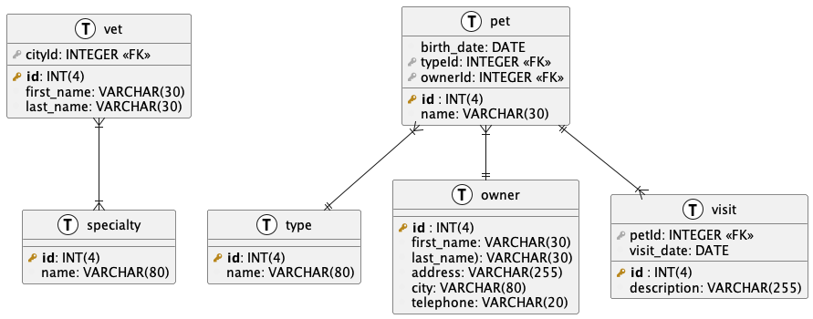

# Database Development Basics

## Relational Database

### Introduction to Relational Databases
- **Definition**: Explain that a relational database is a type of database that stores data in tables.
- **Components**:
    - **Tables**: Collections of rows and columns.
    - **Rows** (Records): Individual entries in a table.
    - **Columns** (Fields): Attributes of the data.

### PetClinic Example
- **Tables**:
    - **Owners**: Information about pet owners.
    - **Pets**: Information about pets.
    - **Visits**: Records of visits to the clinic.
    - **Vets**: Information about veterinarians.
    - **Specialties**: Specialties of veterinarians.

- **Example Tables**:
    - **Owners**: OwnerID (Primary Key), FirstName, LastName, Address, City, Telephone
    - **Pets**: PetID (Primary Key), Name, BirthDate, Type, OwnerID (Foreign Key)
    - **Visits**: VisitID (Primary Key), VisitDate, Description, PetID (Foreign Key)
    - **Vets**: VetID (Primary Key), FirstName, LastName
    - **Specialties**: SpecialtyID (Primary Key), Name

## Non-SQL Database (NoSQL)

### Introduction to NoSQL Databases
- **Definition**: Describe NoSQL databases as flexible databases that store data differently than relational databases.
- **Types of NoSQL Databases**:
    - **Document Databases**: Store data in JSON or BSON format (e.g., MongoDB).
    - **Key-Value Stores**: Data is stored as a collection of key-value pairs (e.g., Redis).
    - **Column Family Stores**: Data is stored in columns rather than rows (e.g., Cassandra).
    - **Graph Databases**: Data is represented as nodes and edges (e.g., Neo4j).

### PetClinic Example with MongoDB
- **Documents**:
    - **Owner**:
      ```json
      { 
        "OwnerID": 1, 
        "FirstName": "John", 
        "LastName": "Doe", 
        "Address": "123 Main St", 
        "City": "Anytown", 
        "Telephone": "555-1234", 
        "Pets": [ 
          {
            "PetID": 1, 
            "Name": "Rover", 
            "BirthDate": "2015-06-01", 
            "Type": "Dog"
          }
        ] 
      }
      ```
    - **Vet**:
      ```json
      { 
        "VetID": 1, 
        "FirstName": "Dr. Smith", 
        "LastName": "Jones", 
        "Specialties": ["surgery", "dentistry"] 
      }
      ```

## ER Diagram (Entity-Relationship Diagram)

### Introduction to ER Diagrams
- **Definition**: Explain that an ER Diagram is a visual representation of the database.
- **Components**:
    - **Entities**: Objects or things in the database (e.g., Owner, Pet, Vet).
    - **Attributes**: Characteristics or properties of entities (e.g., Owner Name, Pet BirthDate).
    - **Relationships**: How entities are related (e.g., an Owner has Pets, a Pet has Visits).

### Creating an ER Diagram for PetClinic
- **Entities and Relationships**:
    - **Owner** has many **Pets**.
    - **Pet** has many **Visits**.
    - **Vet** has many **Specialties** and performs many **Visits**.

- **Example Diagram**:

  <figure>
      
  </figure>

## Frequently Used Queries

### Basic SQL Queries for PetClinic
- **SELECT Statement**: Retrieve all owners.
```sql
SELECT * FROM Owners;
```

- INSERT Statement: Add a new pet.
```sql
INSERT INTO Pets (Name, BirthDate, Type, OwnerID) VALUES ('Bella', '2018-09-15', 'Cat', 1);
```

- UPDATE Statement: Update an owner's address
```sql
UPDATE Owners SET Address = '456 Elm St' WHERE OwnerID = 1;
```

- UPDATE Statement: Update an owner's address
```sql
DELETE FROM Visits WHERE VisitID = 1;
```

### Resources and Tools
- Software: MySQL, SQLite for SQL databases; MongoDB for NoSQL databases.
- Online Platforms: Khan Academy, Code.org, and W3Schools for interactive tutorials.
- Books: “Database Systems: A Practical Approach to Design, Implementation, and Management” by Thomas Connolly and Carolyn Begg (adapted for a younger audience if possible).
